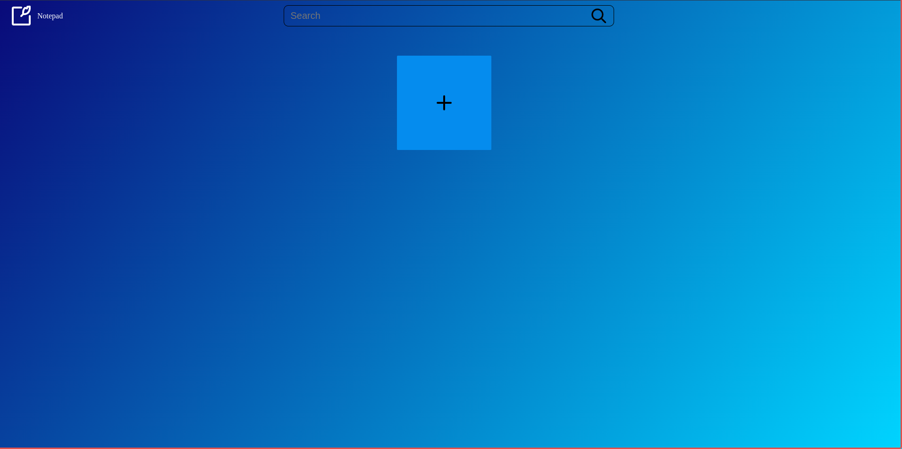
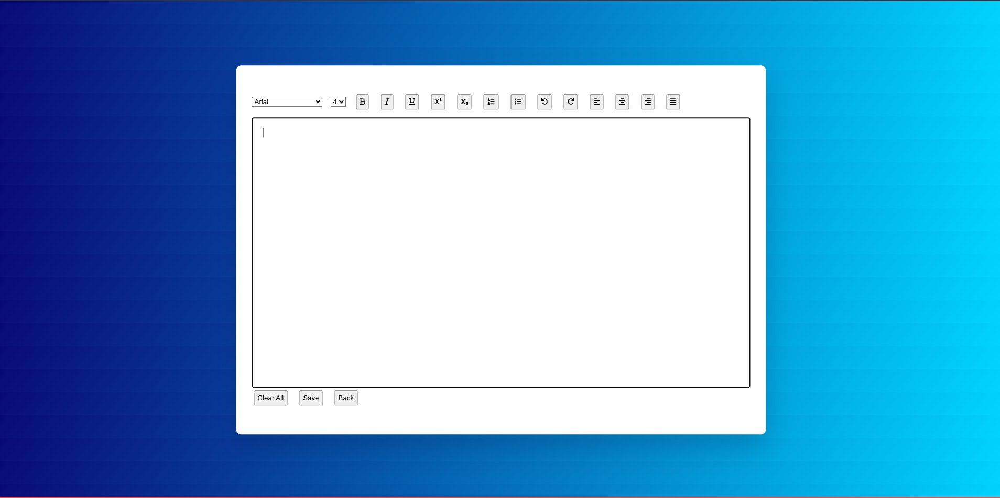

# Notepad App

<!-- TABLE OF CONTENTS -->

# Table of Contents

- [Contents](#table-of-contents)
  - [About The Project](#about-the-project)
    - [Project Walkthrough](#app-walkthrough)
    - [Features](#extra-features)
  - [Built With](#built-with)
  - [Contributing](#contributing)
    - [Special Thanks To](#special-thanks-to)
    - [How To](#how-to)
  - [License](#license)

<!-- ABOUT THE PROJECT -->

## About The Project

A Note taking app. It help to create and store notes of user

### APP Walkthrough

<table border="0" align="center">
  <tr>
      <p align="center" >
          <a href="https://matrix-team.netlify.app/" target="_blank">
              
              <h4 align="center">Main Page</h4>
          </a>
      </p>
  </tr>
  <tr>
    <td>
      <a href="https://matrix-team.netlify.app/" target="_blank">
        
        <h4 align="center">Edit Page</h4>
      </a>
    </td>
    <td>
    <a href="https://matrix-team.netlify.app/" target="_blank">
        
        <h4 align="center">Notes Added</h4>
      </a>
    </td>
  </tr>

</table>

### Features

- Consist all basic feature of notepad editor
- Copy all text by click of a button
- User can see the list of notes
- Store Notes in Local Storage

## Basic structure of the project repository 📂

```terminal
|- index.html            # Home page of app
|- editor.html           # Editor Page
|- readme                # Contains files helps to create project readme
|- assets:               # Contains all source code for the React application.
    |
    |- css          # Contains all CSS files
    |- image        # All image store here
    |- js           # Contain all js files
```

## Built With


<!-- CONTRIBUTING -->

## Contributing

### Special Thanks To

- [Narendra](https://github.com/geeknarendra)
- [Mital](https://github.com/mitalrs)
- [Abhay](https://github.com/AbhaySinghBisht21)
- [Pratik](https://github.com/p-yeole0)

### How To

Contributions are what make the open source community such an amazing place to learn, inspire, and create. Any
contributions you make are **greatly appreciated**.

1. Fork the Project
2. Create your Feature Branch (`git checkout -b feature/AmazingFeature`)
3. Commit your Changes (`git commit -m 'Add some AmazingFeature'`)
4. Push to the Branch (`git push origin feature/AmazingFeature`)
5. Open a Pull Request

<!-- LICENSE -->

## License

[![MIT License][license-shield]][https://matrix-team.netlify.app/]

## Acknowledgements

- [All Contributors](#special-thanks-to)
- [Choose an Open Source License](https://choosealicense.com)
- [Netlify](https://app.netlify.com/)
- [GitHub Socialify](https://socialify.git.ci/)
- [Img Shields](https://shields.io)
